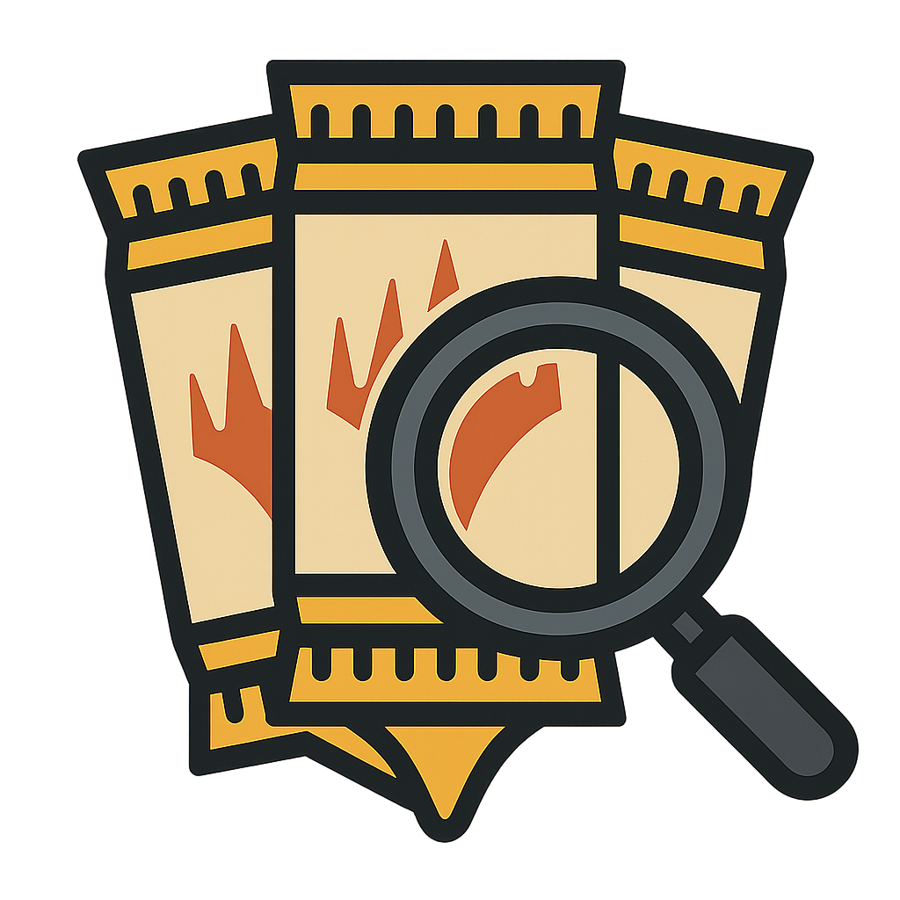

# MTG Best Pull

<p align="center">
  
</p>


MTG Best Pull is a tiny single-page web app that helps you decide which **Magic: The Gathering Arena** booster packs to open to chase the cards you care about.

Paste in a list of cards (decklist, wishlist, or random pile of cardboard), and the app will:
- Match those cards against Arena-legal sets.
- Tell you which booster packs can contain them.
- Highlight where you have the **highest overlap**, so you can prioritize the most efficient packs to open.

No more guessing which set that random rare belongs to or manually cross-checking card pages—this app does the boring part for you.

## Features

- 🧾 **Simple input**: Paste card names line by line into a text area.
- 📦 **Booster mapping**: See which sets/boosters can contain each of your cards.
- 🎯 **Best pulls view**: Quickly understand which boosters cover the largest portion of your list.
- ⚡ **Instant feedback**: Everything runs client-side as a single-page app.
- 🧪 **Made for Arena**: Focused on MTG Arena sets/boosters instead of paper products.

## How It Works

1. You provide a list of card names.
2. The app looks up which Arena sets/boosters those cards appear in.
3. It aggregates the data and shows:
   - Which boosters contain each card.
   - Which boosters give you the best overall coverage of your input list.

(Implementation details live in the source; logic may evolve as Arena products and sets change.)

## Tech Stack

- [React](https://react.dev/) (single-page app)
- [Vite](https://vitejs.dev/) (fast dev/build tooling)
- Vanilla CSS for layout and styling

## Getting Started (Local Development)

```bash
# install dependencies
npm install

# run dev server
npm run dev

# build for production
npm run build
```

Then open the app in your browser and paste some card names to see which boosters are your best bet.

## Usage Notes

- Card/booster mapping is intended for **MTG Arena** and may not reflect all paper-only printings or special products.
- If a card is not recognized or not available in Arena boosters, it may be skipped or flagged in the UI.

## Roadmap Ideas

- Import current Arena collection to cross the cards you already have
- Direct import from Arena deck exports.